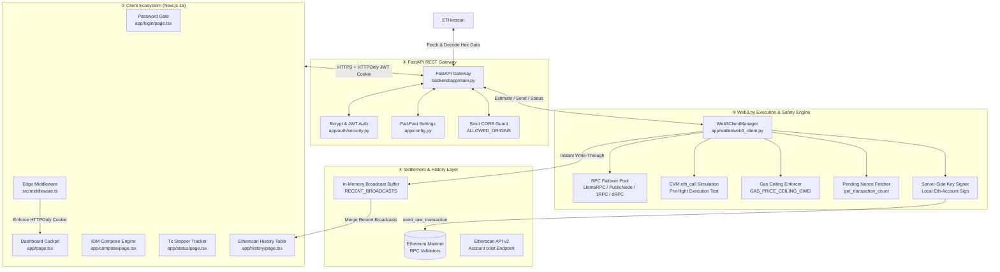
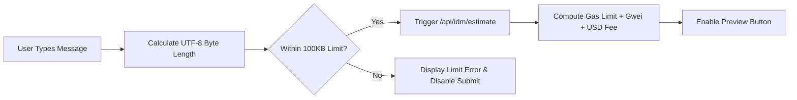
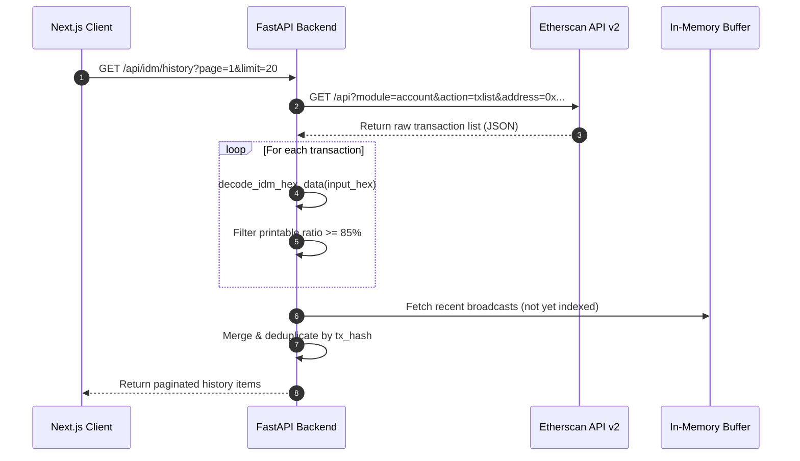
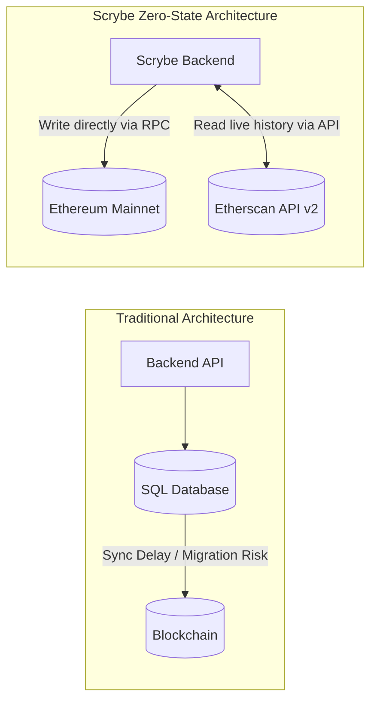
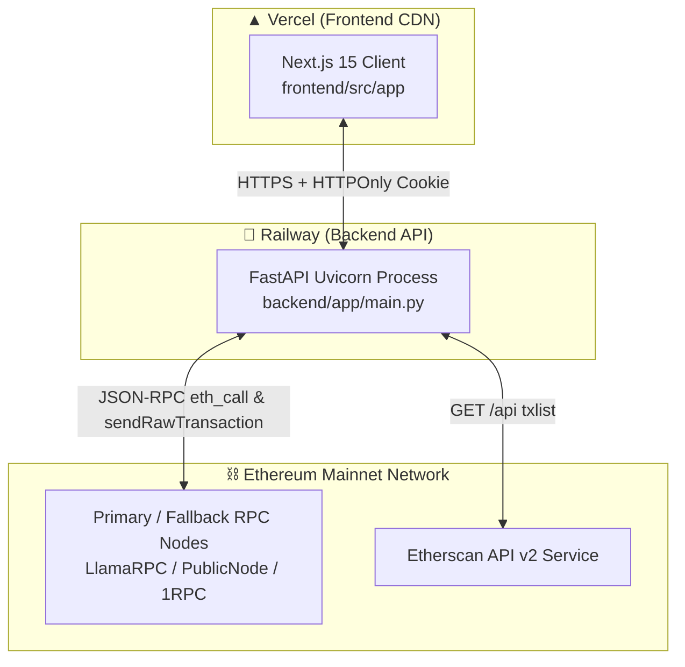

<h1 align="center">Scrybe — On-Chain IDM Logger for Ethereum</h1>

<p align="center">
  <strong>Industrial-Grade, Stateless Input Data Message (IDM) Notarization Engine on Ethereum Mainnet</strong>
</p>

<p align="center">
  <a href="https://scrybe.joshuatochinwachi.online/"></a>&nbsp;
  <a href="./Scrybe.md"></a>&nbsp;
  <a href="https://etherscan.io"></a>
</p>

<p align="center">
  
  
  
  
  
  
  
  
  
</p>

---

> **Scrybe** is a hardened, password-gated, single-operator Input Data Message (IDM) notarization system for **Ethereum Mainnet**. It enables cryptographically authenticated broadcast of arbitrary data payloads embedded directly within 0 ETH Ethereum transactions (`data` hex field). Designed with zero local database footprint, Scrybe uses Ethereum itself as the immutable source of truth and Etherscan API v2 as its stateless history indexer. Featuring server-side private key isolation, gas ceiling protection, pre-flight EVM execution simulation, RPC failover routing, and an ultra-sleek monospace technical UI.

---

## 📖 Table of Contents

- [🏛️ Grand System Architecture](#️-grand-system-architecture)
- [⛓️ On-Chain IDM Mechanics & Verifiability](#️-on-chain-idm-mechanics--verifiability)
- [✨ Feature Highlights](#-feature-highlights)
- [🎬 Technical UI/UX Engine](#-technical-uiux-engine)
- [⚙️ Backend — Python FastAPI Engine](#-backend--python-fastapi-engine)
  - [Fail-Fast Configuration & Environment Guard](#1-fail-fast-configuration--environment-guard)
  - [Web3 Client Manager & RPC Failover](#2-web3-client-manager--rpc-failover)
  - [Transaction Pre-flight Simulation & EIP-1559 Pricing](#3-transaction-pre-flight-simulation--eip-1559-pricing)
  - [Stateless Etherscan API v2 History Indexer](#4-stateless-etherscan-api-v2-history-indexer)
  - [Session Authentication & Bcrypt Hashing](#5-session-authentication--bcrypt-hashing)
- [🖥️ Frontend — Next.js Client](#️-frontend--nextjs-client)
  - [Password Gate & Edge Middleware](#1-password-gate--edge-middleware)
  - [Live Dashboard Cockpit](#2-live-dashboard-cockpit)
  - [Compose Engine & Live Gas Estimator](#3-compose-engine--live-gas-estimator)
  - [Transaction Stepper & Etherscan Verification](#4-transaction-stepper--etherscan-verification)
- [🗄️ Database Architecture & Zero-State Paradigm](#️-database-architecture--zero-state-paradigm)
- [📂 Project Structure & Module Mapping](#-project-structure--module-mapping)
- [🔧 Complete Tech Stack](#-complete-tech-stack)
- [🌐 Deployment Topology](#-deployment-topology)
- [⚙️ Environment Variables Reference](#️-environment-variables-reference)
- [🚀 Setup & Running Locally](#-setup--running-locally)
- [🛡️ Security & Hardening Architecture](#️-security--hardening-architecture)
- [🗺️ Roadmap](#️-roadmap)
- [👥 Developers & Socials](#-developers--socials)

---

## 🏛️ Grand System Architecture

Scrybe is built as a strictly decoupled, stateless architecture. The private key remains completely isolated within server process memory on Railway. Data flows from the Next.js frontend → validated by edge middleware and FastAPI JWT authentication → processed through Web3.py RPC node fallbacks → EVM simulated via `eth_call` → signed & broadcasted on-chain → indexed live via Etherscan API v2.



---

## ⛓️ On-Chain IDM Mechanics & Verifiability

Every message sent through Scrybe is permanently written to the **Ethereum Mainnet** ledger without relying on third-party smart contract code.

### How It Works

1. **UTF-8 Payload Encoding**: The message string (up to `MAX_IDM_BYTES`, default 100KB) is encoded into UTF-8 byte representation.
2. **Zero-ETH Value Transfer**: Scrybe constructs an EIP-1559 transaction setting `value: 0 ETH`. No funds leave the wallet beyond standard network gas fees.
3. **Data Field Embedding**: The hex string (`0x...`) of the UTF-8 payload is attached to the transaction's `data` field.
4. **EVM Simulation**: Before broadcast, `eth_call` tests execution against the RPC node to ensure valid parameters and avoid wasted gas.
5. **On-Chain Commitment**: The transaction is signed locally server-side using `eth_account` and broadcast via Web3.py.
6. **Public Verifiability**: Anyone can copy the transaction hash into Etherscan, switch the `Input Data` view to "View Input As UTF-8", and read the exact, untampered message logged at that block height.

```text
Etherscan Input Data View:
0x48656c6c6f20576f726c6421205468697320697320616e204f6e2d436861696e2049444d204e6f746172697a6174696f6e2e
↓ (Decodes to UTF-8)
"Hello World! This is an On-Chain IDM Notarization."
```

---

## ✨ Feature Highlights

| Feature | Description |
|---|---|
| 🔑 **Bcrypt Password Gate** | Password-authenticated session control using constant-time `bcrypt.checkpw` verification and short-lived HTTPOnly JWT tokens. |
| 🛡️ **Zero-Value Execution Safety** | Transaction value is hardcoded to `0 ETH` on the backend server, entirely eliminating accidental ETH transfer risks. |
| 🔐 **Isolated Server-Side Key** | Private key never touches client JavaScript. Signing takes place exclusively within Railway container memory. |
| ⚡ **RPC Failover & Auto-Recovery** | Automatically tests and cycles between multiple Ethereum RPC endpoints (LlamaRPC, PublicNode, 1RPC, dRPC, Ankr, BlastAPI). |
| ⛽ **Gas Price Ceiling Guard** | Hard safety boundary (`GAS_PRICE_CEILING_GWEI`) prevents broadcasting during gas spikes or RPC pricing anomalies. |
| 🧪 **Pre-Flight EVM Simulation** | Simulates `eth_call` prior to signing, preventing failed on-chain transactions and wasted gas fees. |
| 📊 **Stateless Etherscan API v2 History** | Zero local database. Queries Etherscan API v2 live for all wallet transactions and decodes hex data to UTF-8 on the fly. |
| 🚀 **Instant Memory Buffer Sync** | Newly broadcasted transactions are immediately merged into the history view via an in-memory buffer before Etherscan indexes the block. |
| 🧮 **EIP-1559 Dynamic Fee Estimation** | Automatically calculates `maxFeePerGas` and `maxPriorityFeePerGas` based on base fee dynamics. |
| 💻 **Monospace Technical UI** | Dark-mode design system built with Next.js 15, Tailwind CSS, Lucide icons, and Framer Motion micro-interactions. |

---

## 🎬 Technical UI/UX Engine

Scrybe’s user interface is designed with a high-density, dark-mode technical visual language.

### 1. Monochromatic Technical Aesthetics

- **Accent Palette**: Deep electric cyan/amber against dark obsidian backgrounds (`#0a0a0a`).
- **Typography**: Monospace fonts (`JetBrains Mono` / `Fira Code`) for wallet addresses, transaction hashes, block numbers, and gas readings.
- **Micro-Interactions**: Easing curves (`cubic-bezier`), hover state glows, copy-to-clipboard tooltips, and dynamic status badges.

### 2. Form Guardrails & Live Gas Estimator

The Compose interface calculates UTF-8 byte consumption in real-time as the user types:

- **Live Byte Counter**: Tracks current byte length against `MAX_IDM_BYTES` (100,000 bytes max).
- **Checksum Validator**: Live client-side and server-side address validation (`Web3.to_checksum_address`).
- **Gas Fee Calculator**: Computes estimated gas limit, Gwei rate, estimated ETH fee, and USD equivalent using live ETH pricing data.



### 3. Transaction Stepper & Confirmation Barrier

- **Confirmation Barrier**: Requires an intentional secondary confirmation step before broadcasting to prevent fat-finger sends.
- **Progress Stepper**: Real-time status polling through 4 states: `Broadcasting` → `Pending` → `Mined` → `Confirmed`.

---

## ⚙️ Backend — Python FastAPI Engine

The backend is built in Python 3.12 using FastAPI and `web3.py`. It is deployed on Railway under `backend/`.

### 1. Fail-Fast Configuration & Environment Guard

`backend/app/config.py` — `Settings` class.

Scrybe enforces strict configuration validation at process startup. If critical variables are missing in production, the service fails fast rather than running with insecure fallbacks.

```python
class Settings:
    def __init__(self):
        self.ENVIRONMENT: str = os.getenv("ENVIRONMENT", "development")
        self.APP_PASSWORD_HASH: str = os.getenv("APP_PASSWORD_HASH", "")
        self.JWT_SECRET: str = os.getenv("JWT_SECRET", "")
        self.WALLET_PRIVATE_KEY: str = os.getenv("WALLET_PRIVATE_KEY", "")
        self.ETH_RPC_URL: str = os.getenv("ETH_RPC_URL", "https://eth.llamarpc.com")
        self.MAX_IDM_BYTES: int = int(os.getenv("MAX_IDM_BYTES", "100000"))
        self.GAS_PRICE_CEILING_GWEI: float = float(os.getenv("GAS_PRICE_CEILING_GWEI", "100"))
        self.ALLOWED_ORIGINS: list[str] = [o.strip() for o in os.getenv("ALLOWED_ORIGINS", "").split(",") if o.strip()]
```

### 2. Web3 Client Manager & RPC Failover

`backend/app/wallet/web3_client.py` — `Web3ClientManager` class.

Maintains active connection health across a list of redundant fallback RPC providers:

```python
FALLBACK_RPCS = [
    settings.ETH_RPC_URL,
    "https://ethereum-rpc.publicnode.com",
    "https://1rpc.io/eth",
    "https://eth.drpc.org",
    "https://rpc.ankr.com/eth",
    "https://eth-mainnet.public.blastapi.io"
]
```

Every connection request verifies RPC health by calling `w3.eth.block_number`. If an RPC fails or times out, the client automatically failovers to the next provider seamlessly.

### 3. Transaction Pre-flight Simulation & EIP-1559 Pricing

When building a transaction in `build_sign_and_broadcast_idm()`:

1. **Pending Nonce Verification**: Fetches `w3.eth.get_transaction_count(address, 'pending')` to avoid nonce collisions.
2. **Gas Ceiling Check**: Aborts if current gas price exceeds `GAS_PRICE_CEILING_GWEI`.
3. **EVM Simulation**: Calls `w3.eth.call({'from': sender, 'to': recipient, 'value': 0, 'data': payload})` to verify transaction validity.
4. **EIP-1559 Fee Structure**:
   $$\text{maxPriorityFeePerGas} = 1.5 \text{ Gwei}$$
   $$\text{maxFeePerGas} = (\text{baseFeePerGas} \times 2) + \text{maxPriorityFeePerGas}$$
5. **Local Signing & Broadcast**: Signs raw transaction bytes locally using `account.sign_transaction()` and broadcasts via `send_raw_transaction()`.

### 4. Stateless Etherscan API v2 History Indexer

`backend/app/idm/history.py` — `fetch_etherscan_history()`

Queries Etherscan API v2 (`account/txlist`) for the backend wallet address:

1. Iterates through historical normal transactions.
2. Extracts transaction `input` hex data.
3. Runs `decode_idm_hex_data()`:
   - Converts hex to raw UTF-8 string.
   - Strips legacy `IDM: ` prefixes if present.
   - Evaluates printable character ratio ($\ge 85\%$) to filter out contract calldata.
4. Merges recent in-memory broadcasts from `RECENT_BROADCASTS` buffer.
5. Returns clean paginated JSON payloads to the frontend.



### 5. Session Authentication & Bcrypt Hashing

`backend/app/auth/security.py`

- **Password Verification**: Compares submitted plaintext password against `APP_PASSWORD_HASH` using `bcrypt.checkpw()`.
- **JWT Issuance**: Issues signed HS256 JWT tokens containing `sub: "operator"` with 4-hour expiration.
- **HTTPOnly Cookies**: Sets `scrybe_session` HTTPOnly, Secure, SameSite=Strict cookie on login.

---

## 🖥️ Frontend — Next.js Client

Built with **Next.js 15 (App Router)**, **React 19**, **TypeScript 5**, **Tailwind CSS 3.4**, and **Framer Motion 12**.

### 1. Password Gate & Edge Middleware

`frontend/src/middleware.ts`

Applies edge-level route protection across `/`, `/compose`, `/status`, and `/history`:

- Checks for presence of `scrybe_session` cookie.
- Unauthenticated requests are automatically redirected to `/login`.
- Authenticated requests visiting `/login` are redirected to dashboard (`/`).

### 2. Page Inventory

| Route | File | Purpose |
|---|---|---|
| `/login` | `app/login/page.tsx` | Password gate form with shake animation on error |
| `/` | `app/page.tsx` | Main dashboard displaying live ETH balance, gas price, network status |
| `/compose` | `app/compose/page.tsx` | IDM composer with live byte counter & gas estimator |
| `/status` | `app/status/page.tsx` | Real-time status stepper polling transaction receipts |
| `/history` | `app/history/page.tsx` | Paginated Etherscan history table with live search |

---

## 🗄️ Database Architecture & Zero-State Paradigm

Scrybe contains **zero persistent database tables** by design.



### Why Zero Database?

1. **Immutable Source of Truth**: Ethereum Mainnet *is* the database. Storing a local copy introduces data drift risk.
2. **Zero Attack Surface**: No SQL injection vulnerabilities, no database credential leaks, no table corruption.
3. **Zero Maintenance**: No database migrations, no backups, no hosting costs.
4. **Universal Accuracy**: Any IDM sent from the wallet—whether via Scrybe UI, CLI script, or Etherscan write contract—appears automatically in Scrybe history.

---

## 📂 Project Structure & Module Mapping

```text
Scrybe/
├── backend/                            # Python FastAPI Backend
│   ├── main.py                         # Application entry, CORS config, router inclusion
│   ├── check_balance.py                # Diagnostic script to check wallet ETH balance
│   ├── check_tx_data.py                # Diagnostic script to inspect raw transaction input hex
│   ├── debug_chain_balances.py         # Multi-RPC balance diagnostic utility
│   ├── generate_hash.py                # Utility helper to generate bcrypt password hashes
│   ├── test_backend.py                 # Backend unit and integration test suite
│   ├── test_wallet_lookup.py           # Wallet derivation sanity check
│   ├── requirements.txt                # Python dependencies (FastAPI, Web3, PyJWT, Bcrypt)
│   └── app/
│       ├── __init__.py
│       ├── config.py                   # Environment settings & fail-fast validator
│       ├── main.py                     # App instance exports
│       ├── auth/
│       │   ├── routes.py               # /api/auth/login, logout, session check routes
│       │   └── security.py             # Bcrypt password check & JWT token generation
│       ├── idm/
│       │   ├── history.py              # Etherscan API v2 reader & UTF-8 hex decoder
│       │   ├── routes.py               # /api/idm/estimate, send, status, history endpoints
│       │   └── schemas.py              # Pydantic request/response schemas
│       └── wallet/
│           ├── routes.py               # /api/wallet/info endpoint
│           └── web3_client.py          # Web3ClientManager: RPC failover, signing, simulation
│
├── frontend/                           # Next.js 15 App Router Frontend
│   ├── package.json                    # Node dependencies (Next.js, React 19, Tailwind, Framer Motion)
│   ├── next.config.js                  # Next.js configuration
│   ├── postcss.config.js               # PostCSS pipeline
│   ├── tailwind.config.js              # Tailwind CSS configuration
│   ├── tsconfig.json                   # TypeScript strict config
│   ├── vercel.json                     # Vercel deployment metadata
│   └── src/
│       ├── middleware.ts               # Edge session guard middleware
│       ├── app/
│       │   ├── layout.tsx              # Root layout & font loading
│       │   ├── globals.css             # Dark theme styles & global utilities
│       │   ├── page.tsx                # Dashboard cockpit page
│       │   ├── compose/
│       │   │   └── page.tsx            # IDM compose form & confirmation modal
│       │   ├── history/
│       │   │   └── page.tsx            # Paginated Etherscan history table
│       │   ├── login/
│       │   │   └── page.tsx            # Password gate UI
│       │   └── status/
│       │       └── page.tsx            # Live transaction polling status page
│       └── components/
│           └── Navbar.tsx              # Navigation bar & network status pill
│
├── .env                                # Local secrets file (git-ignored)
├── .gitignore                          # Standard git exclusion rules
├── nixpacks.toml                       # Nixpacks build configuration for Railway
├── Procfile                            # Railway process execution command
├── railway.json                        # Railway deployment config
├── Scrybe.md                           # Full Product & Technical Requirements Document
└── README.md                           # ← You are here
```

---

## 🔧 Complete Tech Stack

### Backend

| Component | Technology | Version | Role |
|---|---|---|---|
| Language | Python | 3.12+ | Core runtime environment |
| Web Framework | FastAPI | 0.115+ | High-performance async REST API framework |
| ASGI Server | Uvicorn | 0.28+ | Production HTTP server |
| Web3 Library | Web3.py | 6.15+ | Ethereum RPC provider interaction & raw tx signing |
| Cryptography | eth-account | 0.11+ | Server-side private key keypair derivation & signing |
| Authentication | PyJWT + Bcrypt | latest | JWT HS256 token creation & constant-time password verification |
| HTTP Client | httpx | 0.27+ | Async client for Etherscan API v2 requests |
| Data Models | Pydantic | 2.6+ | Type safety and request/response validation |

### Frontend

| Component | Technology | Version | Role |
|---|---|---|---|
| Framework | Next.js | 15.1.7 | React App Router framework |
| Language | TypeScript | 5.7+ | Full type safety across all components |
| Library | React | 19.0.0 | Component rendering engine |
| Styling | Tailwind CSS | 3.4+ | Utility-first styling framework |
| Animation | Framer Motion | 12.4+ | UI animations and micro-interactions |
| Icons | Lucide React | 0.475+ | Monochromatic iconography |

---

## 🌐 Deployment Topology



---

## ⚙️ Environment Variables Reference

Create a `.env` file in the root directory.

```bash
# ─── Security & Authentication ───────────────────────────────────────────────
APP_PASSWORD_HASH=$2b$12$...        # bcrypt hash of your access password
JWT_SECRET=your_long_random_jwt_secret_key_here
JWT_EXPIRATION_HOURS=4

# ─── Web3 & Blockchain ───────────────────────────────────────────────────────
WALLET_PRIVATE_KEY=0x...            # 0x-prefixed Ethereum private key (backend only)
ETH_RPC_URL=https://eth.llamarpc.com
ETHERSCAN_API_KEY=your_etherscan_api_key

# ─── Operational Guardrails ──────────────────────────────────────────────────
MAX_IDM_BYTES=100000                # Hard ceiling on payload size (100KB)
GAS_PRICE_CEILING_GWEI=100           # Refuse broadcast if network gas exceeds 100 Gwei
ALLOWED_ORIGINS=https://scrybe.joshuatochinwachi.online

# ─── Environment Settings ───────────────────────────────────────────────────
ENVIRONMENT=production
LOG_LEVEL=info
```

---

## 🚀 Setup & Running Locally

### Prerequisites

- **Python 3.12+**
- **Node.js 20+**
- An **Ethereum Private Key** (funded with ETH for mainnet gas)
- An **Etherscan API Key** (free tier from [etherscan.io](https://etherscan.io))

### 1. Clone & Setup Repository

```bash
git clone https://github.com/joshuatochinwachi/Scrybe.git
cd Scrybe
```

### 2. Generate Password Hash

Generate a Bcrypt hash for your desired password using the included helper:

```bash
python backend/generate_hash.py
# Enter your desired password when prompted
# Copy the resulting $2b$12$... hash into your .env file as APP_PASSWORD_HASH
```

### 3. Start Python Backend

```bash
cd backend
python -m venv venv
# On Windows:
venv\Scripts\activate
# On Linux/macOS:
source venv/bin/activate

pip install -r requirements.txt
uvicorn app.main:app --host 127.0.0.1 --port 8000 --reload
```

Backend API documentation will be accessible at: `http://localhost:8000/docs`

### 4. Start Next.js Frontend

In a separate terminal window:

```bash
cd frontend
npm install
npm run dev
```

Open `http://localhost:3000` in your web browser.

---

## 🛡️ Security & Hardening Architecture

1. **Constant-Time Password Verification**: Uses `bcrypt.checkpw()` to mitigate timing side-channel attacks during password evaluation.
2. **HTTPOnly Session Cookies**: Session tokens are marked `HttpOnly`, `Secure`, and `SameSite=Strict` to prevent XSS credential theft.
3. **Server-Side Key Isolation**: The wallet private key is never exposed to API responses, client bundles, or frontend code.
4. **Hardcoded Zero-Value Transfers**: `value: 0` is strictly enforced server-side inside `web3_client.py`.
5. **EVM Execution Pre-flight Simulation**: Runs `eth_call` before broadcasting to avoid burning gas on failing transactions.
6. **Gas Price Ceiling Guardrail**: Aborts execution if current network Gwei exceeds `GAS_PRICE_CEILING_GWEI`.
7. **Strict CORS Policies**: `ALLOWED_ORIGINS` strictly controls allowed cross-origin HTTP requests.

---

## 🗺️ Roadmap

- [x] **Password Gate & Session Management** — Bcrypt hashing + HTTPOnly JWT auth.
- [x] **Server-Side EIP-1559 Signing** — Web3.py client with RPC failover pool.
- [x] **Stateless Etherscan API v2 History** — Real-time hex decoding to UTF-8.
- [x] **Pre-flight EVM Simulation** — `eth_call` pre-verification before broadcast.
- [x] **Monospace Technical Interface** — Next.js 15, Tailwind CSS, Framer Motion UI.
- [ ] **Telegram Push Notifications** — Optional instant Telegram alerts on transaction confirmation.
- [ ] **IDM Message Templates** — Quick-fill presets for AI recommendation logs & notarizations.
- [ ] **Multi-Chain Expansion** — Extend zero-value logging to Arbitrum, Optimism, and Base.
- [ ] **Cloud HSM Key Management** — Integrate AWS KMS / Google Cloud KMS for hardware-backed signing.

---

## 👥 Developers & Socials

### 💻 Software Developer
**[Jo$h](https://x.com/defi__josh)**

| Channel | Link |
|---|---|
| 𝕏 Twitter | [@defi__josh](https://x.com/defi__josh) |
| Telegram | [@joshuatochinwachi](https://t.me/joshuatochinwachi) |
| Email | [joshuatochinwachi@gmail.com](mailto:joshuatochinwachi@gmail.com) |

---

<p align="center">
  Built with ⚡ by <strong><a href="https://x.com/defi__josh">Jo$h</a></strong> for <strong>Ethereum Mainnet</strong>
  <br/>
  <a href="https://scrybe.joshuatochinwachi.online">scrybe.joshuatochinwachi.online</a> &nbsp;·&nbsp;
  <a href="https://x.com/defi__josh">@defi__josh</a>
</p>
